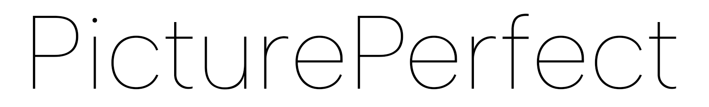
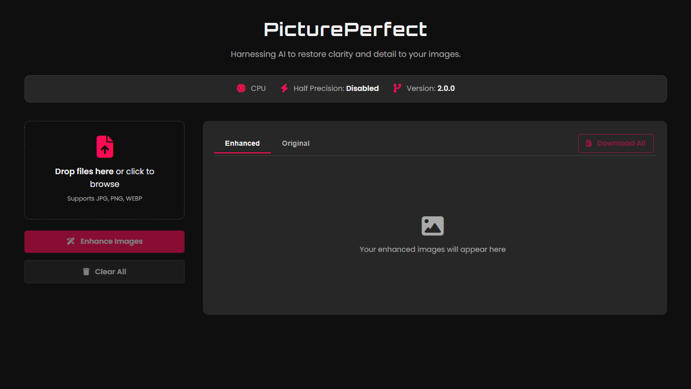

# 🌟 PicturePerfect

## 🚀 AI-Powered Image Upscaler & Enhancer



---

## 🗂️ Table of Contents

- [📖 Introduction](#-introduction)
- [✨ Features](#-features)
- [🚀 Installation](#-installation)
- [💡 Auto-Start on Boot (Windows)](#-auto-start-on-boot-windows)
- [💻 Usage](#-usage)
- [🤝 Contributing](#-contributing)
- [📜 License](#-license)

---

## 📖 Introduction

Welcome to **PicturePerfect** – where your blurry, low-res images get a major glow-up! 🌈

PicturePerfect is an AI-powered image enhancer that transforms your low-quality pics into high-resolution masterpieces. Using cutting-edge deep learning models, it sharpens details, improves colors, and makes your images pop – all with a super slick web interface that can run as a background service.

Say goodbye to pixelation – and hello to perfection! 😎

---

## ✨ Features

🔥 **AI Magic:** Sharpens and enhances images using deep learning models from GFPGAN and Real-ESRGAN.  
⚡ **GPU Boost:** Automatically leverages your NVIDIA GPU for lightning-fast processing.  
💡 **Background Service:** A one-time setup script can configure the app to launch silently on boot.
🖥️ **Slick Web UI:** A modern, intuitive interface for a seamless user experience.  
💪 **Robust Model Downloader:** A non-closeable, one-time setup dialog ensures all models are downloaded correctly before you start.  
🚋 **Batch Processing:** Process multiple images at once like a pro.  
🧱 **Side-by-Side Previews:** Instantly see the difference between your original and enhanced images.  
🏎️ **Quick Downloads:** Save enhanced images individually or as a convenient ZIP file.  
🖱️ **Drag and Drop:** No complicated menus – just drop your files and go!

---

## 🚀 Installation

The recommended way to install PicturePerfect on Windows is using our automated script, which handles everything for you.

### 🪟 Windows (Automated Installation)

This is the easiest way to get started. Just follow these steps:

1.  **Prerequisites:** Make sure you have **[Anaconda/Miniconda](https://www.anaconda.com/download)** and **[Git](https://git-scm.com/download/win)** installed on your system.
2.  **Clone the Repository:** Open a terminal (like Command Prompt or PowerShell) and run:
    ```bash
    git clone https://github.com/Md-Siam-Mia-Code/PicturePerfect.git
    cd PicturePerfect
    ```
3.  **Run the Installer:** Simply double-click the **`install.bat`** file in the project folder.

The script will automatically:

- Detect your Conda installation.
- Detect if you have an NVIDIA GPU and choose the correct PyTorch version.
- Create a dedicated `PicturePerfect` Conda environment.
- Install all required libraries.
- Launch the application!

After the first run, you can just double-click **`install.bat`** again to directly launch the application.

### 🛠️ Manual Installation (All Platforms)

For Linux, macOS, or advanced users.

1.  **Clone the Repository:**

    ```bash
    git clone https://github.com/Md-Siam-Mia-Code/PicturePerfect.git
    cd PicturePerfect
    ```

2.  **Create and Activate Conda Environment:**

    ```bash
    conda create -n PicturePerfect python=3.7 -y
    conda activate PicturePerfect
    ```

3.  **Install PyTorch:**

    - **For NVIDIA GPU (Recommended):** This command installs a CUDA 11.8 compatible version.
      ```bash
      conda install pytorch torchvision torchaudio pytorch-cuda=11.8 -c pytorch -c nvidia -y
      ```
    - **For CPU Only:**
      ```bash
      conda install pytorch torchvision torchaudio cpuonly -c pytorch -y
      ```

4.  **Install Dependencies:**
    ```bash
    pip install -r requirements.txt
    ```

---

## 💡 Auto-Start on Boot (Windows)

Want PicturePerfect to run as a background service every time you start your computer? Just run the auto-start setup script!

1.  Complete the installation steps above first.
2.  Navigate to the `PicturePerfect` project folder.
3.  Right-click on **`auto_start.bat`**.
4.  Select **"Run as administrator"**.

This will create a scheduled task that launches the server silently in the background whenever you log in. You only need to do this once! The server will be available at `http://127.0.0.1:3015` after you log in.

---

## 💻 Usage

### ▶️ Running the Application

- **On Windows (Standard):** Double-click the **`install.bat`** script.
- **On any platform (Manually):** Make sure your `PicturePerfect` conda environment is activated, then run:
  ```bash
  python main.py
  ```

### 🌐 Access the Web Interface

Once the server is running, open your browser and go to: **[http://127.0.0.1:3015](http://127.0.0.1:3015)**

### 📸 How to Enhance Images

1.  **First Launch:** Wait for the app to automatically download the required AI models. A dialog will show the progress.
2.  **Upload Images:** Drag and drop or click to select `.jpg`, `.jpeg`, or `.png` files.
3.  **Enhance:** Hit the **<i class="fa-solid fa-wand-magic-sparkles"></i> Enhance Images** button and let the magic happen!
4.  **View & Compare:** Switch between the "Enhanced" and "Original" tabs to see the results.
5.  **Download:** Save your enhanced images individually or get them all in a ZIP file with the "Download All" button.

---

## 🤝 Contributing

🎉 **Want to make PicturePerfect even more perfect?**

1. 🌟 Fork the repository
2. 📂 Create a new branch (`git checkout -b feature/YourAwesomeFeature`)
3. 📝 Commit your changes (`git commit -m 'Add some awesome feature'`)
4. 📤 Push to the branch (`git push origin feature/YourAwesomeFeature`)
5. 🔃 Open a Pull Request – and boom, you're a contributor!

---

## 📜 License

This project is licensed under the **MIT License** – because good things should be shared. 😎

---

### ❤️ _Picture-perfect results, every time!_
